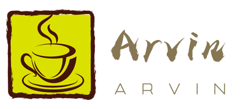

# Power By Arvin

## 工程说明

    使用的是Unity 2019 STL 版本，主要是将之前写的一些优化模块进行整合（包括UWA 和部分开源库，整理完以后会将开源库链接置于底部），属于整理个人代码。

### 1.图片查看和批量压缩

    工具路径

### 2.音频批量压缩

    工具路径

### 3.特效处理

    工具路径

### 4.动画工具

    工具路径

### 5.资源检查工具

    工具路径

### 6. 代码检查

    工具路径

### 6.Jenkins 统一处理

    工具路径
